## [Domain Model](global-artifacts/puml/DM.puml)

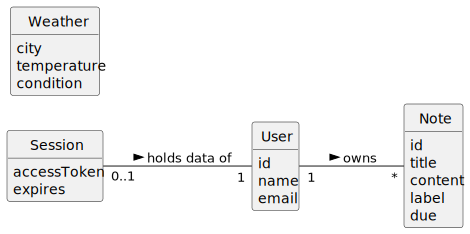

---

## [Use Case Diagram](global-artifacts/puml/UCD.puml)

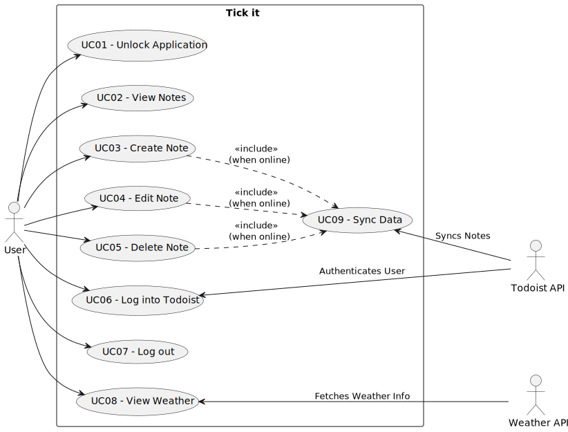

---

## [Deployment Diagram](global-artifacts/puml/DD.puml)

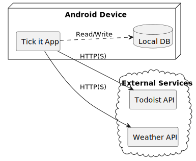

---

## [Package Diagram](global-artifacts/puml/PD.puml)

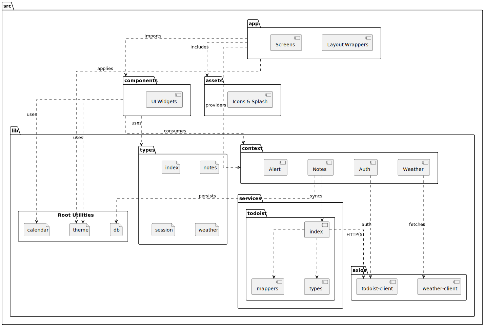

---

## Use Cases

### [UC01 - Unlock Application](UC01)

- [System Sequence Diagram](UC01/puml/SSD.puml)

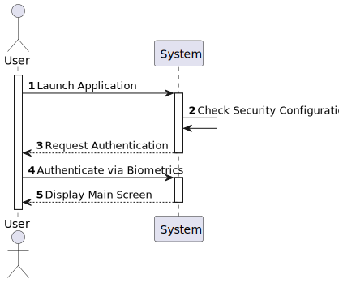

---

### [UC02 - View Notes](UC02)

- [System Sequence Diagram](UC02/puml/SSD.puml)

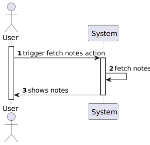

---

### [UC03 - Create Note](UC03)

- [System Sequence Diagram](UC03/puml/SSD.puml)

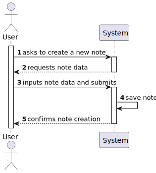

---

### [UC04 - Edit Note](UC04)

- [System Sequence Diagram](UC04/puml/SSD.puml)

---

### [UC05 - Delete Note](UC05)

- [System Sequence Diagram](UC05/puml/SSD.puml)

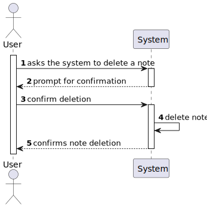

---

### [UC06 - Log Into Todoist](UC06)

- [System Sequence Diagram](UC06/puml/SSD.puml)

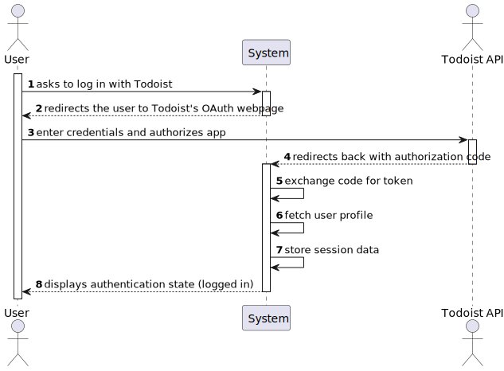

---

### [UC07 - Log out](UC07)

- [System Sequence Diagram](UC07/puml/SSD.puml)

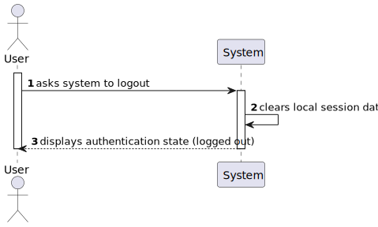

---

### [UC08 - View Weather](UC08)

- [System Sequence Diagram](UC08/puml/SSD.puml)

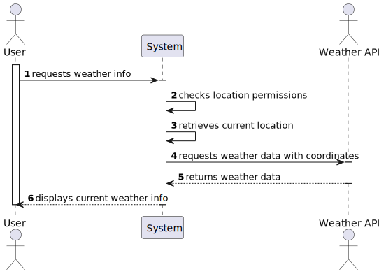

---

### [UC09 - Sync Data](UC09)

- [System Sequence Diagram](UC09/puml/SSD.puml)

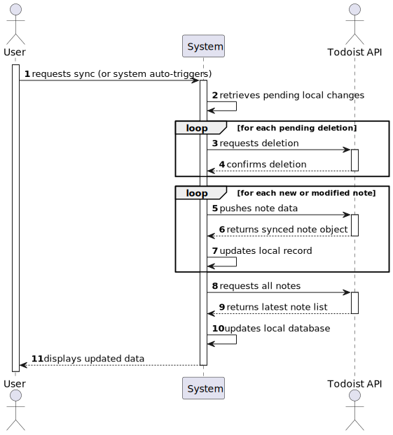
